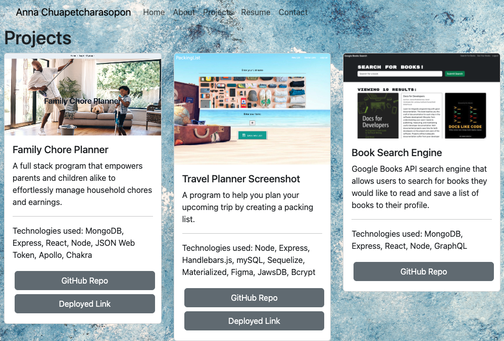

# Anna-Chuapetcharasopon-Portfolio

## Description

Anna's portfolio created using React. Through this project I learned how to use React components and pages and how to create a working email form.

## Installation

To use the program visit the deployed link and interact with application. You can navigate to the following pages: Home, About, Projects, Resume, Contact. Enter your email address to be contacted by Anna. 

## Usage

- Deployed Link: https://annachuapetcharasopon.netlify.app/ 
- Github Repository: https://github.com/ahgeak/react_portfolio_anna 

Screenshot of Portfolio:

## Credits

I created this portfolio on my own with reference to topics I learned in class.

## License

This project uses an MIT license.
